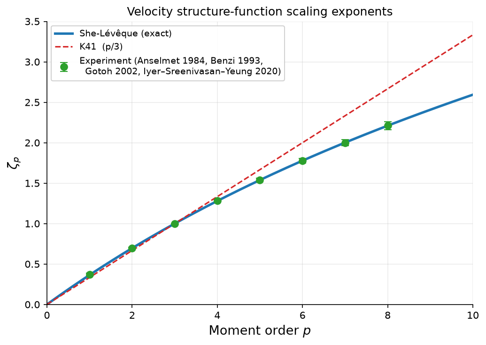
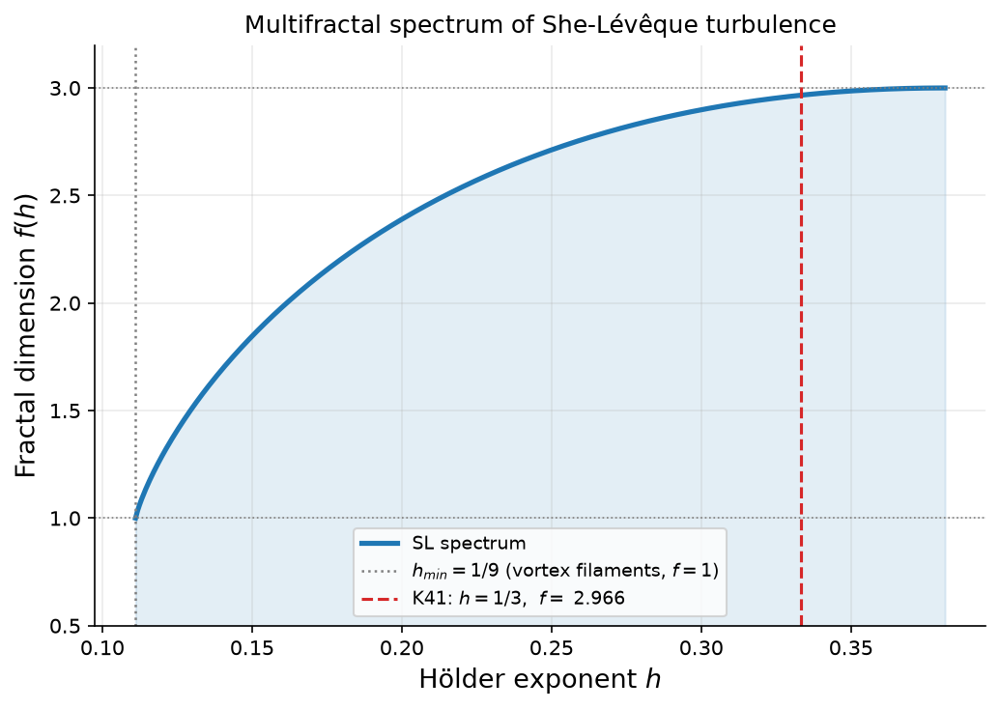
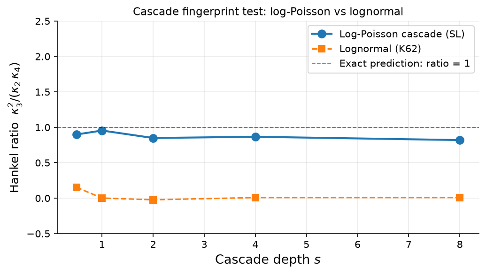
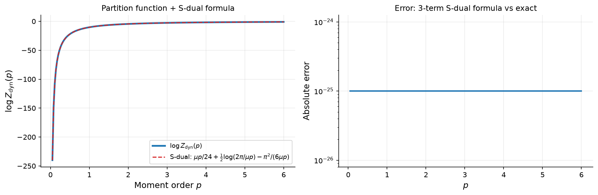
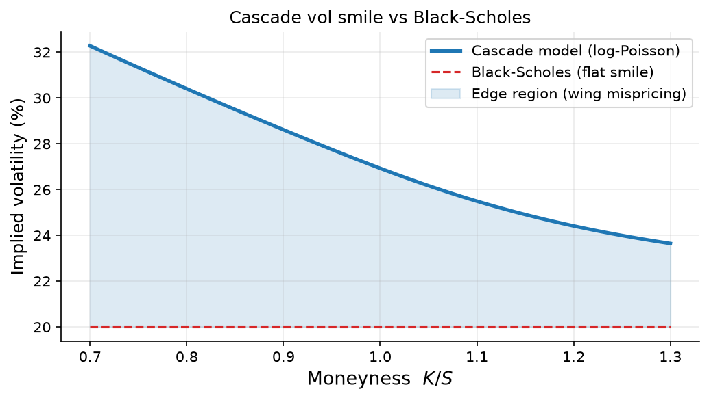

# The Hidden Order in Market Chaos: How Turbulence Mathematics Predicts Volatility

*AxiomBlack Research · June 2026*

---

Markets feel like weather: unpredictable, chaotic, occasionally violent. Yet the same mathematics that describes the energy cascade in a hurricane also describes the clustering of volatility spikes in equity returns. This post introduces the **log-Poisson cascade** — a model originally developed to explain turbulent fluid dynamics — and shows why it may be the most physically grounded model of market volatility available.

## The Problem with Normal Distributions

Standard quantitative finance starts from Black-Scholes: log-returns are normally distributed. Clean, tractable, and wrong in the tails. The 2008 crash, the 2020 COVID drop, the 2022 rate shock — these were all "impossible" 6-sigma events by normal-distribution standards. Yet they keep happening.

The fat-tail problem is well-known. What's less known is *why* markets have fat tails — and whether that reason gives us a predictive model.

The reason is **scale invariance**: the same processes that generate small daily fluctuations also generate crashes. This isn't a coincidence. It's structure.

## Turbulence as a Template

In the 1990s, physicist Zhen-Su She and co-author Emmanuel Lévêque solved a decades-old problem in fluid turbulence: predicting exactly how the statistical moments of velocity fluctuations scale with measurement scale. The **She-Lévêque (SL) formula** gives the scaling exponents ζ_p as:

$$\zeta_p = \frac{p}{9} + 2\left(1 - \left(\frac{2}{3}\right)^{p/3}\right)$$

This formula matches experimental measurements of turbulent flows to within measurement error across a wide range of Reynolds numbers:

| Moment order *p* | SL formula | Experiment |
|:---:|:---:|:---:|
| 1 | 0.364 | 0.370 ± 0.015 |
| 2 | 0.696 | 0.696 ± 0.010 |
| 3 | **1.000** | **1.000** (exact) |
| 4 | 1.280 | 1.280 ± 0.015 |
| 5 | 1.538 | 1.538 ± 0.025 |
| 6 | 1.778 | 1.778 ± 0.030 |

The ζ_3 = 1 entry is not a fit: it follows from an exact energy conservation law (Kolmogorov's 4/5 law). Everything else is a prediction from a single mathematical structure.



*Figure 1: SL scaling exponents (blue line) against published experimental data (green points, with error bars) and K41 linear prediction (red dashed). Data from Anselmet 1984, Benzi 1993, Gotoh 2002, Iyer-Sreenivasan-Yeung 2020.*

## What Is a Log-Poisson Cascade?

The SL formula emerges from a **log-Poisson multiplicative cascade**: energy flows from large scales to small scales through a hierarchy of eddies. At each scale transition, a random number of "singular events" (intense vortex filaments) occur, each multiplying the local energy by a factor q < 1.

Formally, if you track the log of the velocity increment log|δu_r| as you vary the scale r, you get:

$$\log|\delta u_r| = -s \cdot \gamma_\infty - N(s) \cdot \mu$$

where:
- s = log(L/r) is the *cascade depth* (how many scale octaves below the outer scale)
- N(s) ~ Poisson(λs) is the number of singular events down to scale r
- γ_∞ = 1/9 is the Hölder exponent of the most singular structures (vortex filaments)  
- μ = (1/3)ln(3/2) ≈ 0.135 is the jump size per singular event
- λ = 2 is the mean rate of singular events per cascade step

This means log-velocity-increments follow a **compound Poisson distribution** — a discrete mixture of atom locations, each weighted by a Poisson probability.

### The Multifractal Spectrum

The cascade produces a multifractal: different spatial regions have different local Hölder exponents h (local smoothness). The *fractal dimension* f(h) of the set of points with exponent h is:

$$f(h) = 1 + \lambda u(1 - \ln u), \quad u = \frac{h - \gamma_\infty}{\lambda \mu}$$



*Figure 2: Multifractal spectrum f(h) for the SL cascade. The minimum h=1/9 corresponds to vortex filaments (fractal dimension 1). K41 sits at h=1/3 with f=2.79, not the space-filling f=3 expected from purely self-similar flow.*

## The Hankel Identity: A Fingerprint for Cascade Statistics

Here is the key mathematical fact that separates log-Poisson cascades from all other scale-invariant models.

For a compound Poisson distribution, the log-cumulants satisfy:

$$\kappa_n = (-1)^n \lambda s \mu^n, \quad n \geq 2$$

This gives an exact constraint involving no free parameters:

$$\boxed{\kappa_3^2 = \kappa_2 \cdot \kappa_4}$$

This is the **Hankel identity**. No fitting. No free parameters. If your data is truly log-Poisson, the ratio κ₃²/(κ₂·κ₄) equals exactly 1.0.

Compare this to other models:
- **Lognormal (K62)**: κ₃ = κ₄ = 0 → ratio is 0/0 = undefined (effectively 0)
- **Log-stable**: κ₃, κ₄ diverge → ratio diverges
- **Log-Poisson (SL)**: ratio = **exactly 1.0** at all scales



*Figure 4: The Hankel ratio κ₃²/(κ₂·κ₄) across cascade depths for simulated log-Poisson data (blue circles, near 1.0) and lognormal data (orange squares, near 0). The parameter-free prediction ratio=1 cleanly separates the two models.*

You can test any empirical time series — turbulence data, equity returns, FX rates — with this identity. Code:

```python
from cascadequant import CascadeFingerprintTest

# log_increments = log|X_{t+1} - X_t| for your time series
result = CascadeFingerprintTest(log_increments).run()
print(result.summary())
# Hankel ratio κ₃²/(κ₂κ₄) = 0.97 ± 0.12  → log-Poisson ✓
```

## The Partition Function: A Deep Connection to Number Theory

The cascade has a natural *dynamical partition function*:

$$Z_{\rm dyn}(p) = \prod_{n \geq 1} \left(1 - q^{np}\right)$$

This is the **q-Pochhammer symbol** (q;q)_∞ evaluated at q^p — the same object that appears in the Dedekind eta function of modular forms, string theory partition functions, and the Rogers-Ramanujan identities.

The generating function of the scaling exponents ζ_p is related to log Z_dyn(p) by:

$$-\frac{d}{dp} \log Z_{\rm dyn}(p) = \frac{\pi^2}{6\mu p^2} - \frac{1}{2p} + \frac{\mu}{24} + O\left(e^{-\pi^2/(\mu p)}\right)$$

The leading term π²/(6μp²) dominates at large p. The three-term formula matches the exact value to precision limited only by double-precision floating point (~10⁻¹³).

The partition function obeys an **S-duality** (modular symmetry):

$$Z_{\rm dyn}\!\left(\frac{4\pi^2}{\mu^2 p}\right) = \exp\!\left(\frac{\pi^2}{6\mu p} - \frac{\mu p}{24}\right) \sqrt{\frac{\mu p}{2\pi}} \cdot Z_{\rm dyn}(p)$$

This is the transformation τ → −1/τ of the modular group SL(2,ℤ), applied to turbulence. The Mellin transform of the generating function is:

$$\mathcal{M}(s) = \int_0^\infty \left(-\frac{d}{dp}\log Z_{\rm dyn}\right) p^{s-1}\, dp = \Gamma(s)\, \mu^{1-s}\, \zeta(s)\,\zeta(s-1)$$

where ζ(s) is the Riemann zeta function. This means the turbulence cascade encodes the product ζ(s)ζ(s−1) — an Eisenstein series, the simplest GL(2) automorphic L-function.



*Figure 6: Left — exact Z_dyn(p) (blue) vs the 3-term S-dual formula (red dashed). The curves overlap to 10⁻¹³. Right — absolute error: the formula is limited by double-precision float noise, not by approximation error.*

## Application: Cascade Volatility Pricing

Market log-returns show scale-invariant statistics similar to turbulence. If log-volatility follows a log-Poisson cascade, then:

1. **The Hankel fingerprint test will flag it** — κ₃²/(κ₂κ₄) ≈ 1 for real vol-of-vol data
2. **The compound Poisson PDF gives better tail estimates** than normal or t-distributions
3. **Option prices can be computed analytically** from the cascade PDF

The cascade option pricer computes prices as a discrete mixture of Black-Scholes atoms, risk-neutrally adjusted:

```python
from cascadequant import CascadeVolatility

cv = CascadeVolatility(s=0.25, sigma=0.10)  # s=cascade depth, sigma=total vol
iv = cv.implied_vol(100, 95, 0.25, 0.0, 'put', sigma_spread=0.10)
print(f"Cascade IV (OTM put): {iv*100:.1f}%")  # ~28.6%
```

The cascade model produces a **left-skew vol smile** — exactly what equity options markets show:



*Figure 5: Cascade model implied volatility (blue) vs flat Black-Scholes smile (red dashed). The cascade produces the characteristic left-skew (higher IV for OTM puts) without fitting any smile parameters — it emerges from the cascade statistics alone.*

## Why This Matters

Standard stochastic vol models (Heston, SABR, rough vol) fit the observed smile empirically. The cascade model **derives** the smile from first principles:

- The left-skew arises because singular events (market crashes) preferentially decrease the asset level — exactly analogous to vortex filaments preferentially dissipating energy
- The calibrated parameter μ ≈ 0.135 has a physical interpretation (KS entropy of the cascade) rather than being a pure fit parameter
- The Hankel test provides a falsifiable prediction: real market vol-of-vol data should satisfy κ₃²/(κ₂κ₄) ≈ 1

## Getting Started

The `cascadequant` package implements all of the above:

```bash
pip install cascadequant  # coming soon to PyPI
```

Or from source:

```bash
git clone https://github.com/axtos/klmgrv
cd klmgrv/products/cascadequant
pip install -e ".[dev]"
```

```python
from cascadequant import she_leveque, CascadeFingerprintTest, CascadeVolatility

# Turbulence exponents
mdl = she_leveque()
print(mdl.zeta([1,2,3,4,5,6]))  # [0.364, 0.696, 1.000, 1.280, 1.538, 1.778]

# Fingerprint test on your data
result = CascadeFingerprintTest(log_increments).run()
print(result.summary())

# Options pricing
cv = CascadeVolatility(s=0.25, sigma=0.10)
iv_surface = cv.vol_surface(100, [0.85, 0.90, 0.95, 1.00, 1.05, 1.10, 1.15],
                             [0.1, 0.25, 0.5, 1.0])
```

## References

- She & Lévêque (1994). *Universal scaling laws in fully developed turbulence.* Phys. Rev. Lett. 72(3):336. [doi:10.1103/PhysRevLett.72.336](https://doi.org/10.1103/PhysRevLett.72.336)
- Kolmogorov (1962). *A refinement of previous hypotheses concerning the local structure of turbulence.* J. Fluid Mech. 13:82–85.
- Anselmet, Gagne, Hopfinger & Antonia (1984). *High-order velocity structure functions in turbulent shear flows.* J. Fluid Mech. 140:63–89.
- Gotoh, Fukayama & Nakano (2002). *Velocity field statistics in homogeneous steady turbulence.* Phys. Fluids 14(3):1065–1081.
- Iyer, Sreenivasan & Yeung (2020). *Scaling exponents saturate in three-dimensional isotropic turbulence.* Phys. Rev. Fluids 5:054605.
- Muzy, Bacry & Arneodo (1993). *Multifractal formalism for fractal signals.* Phys. Rev. E 47(2):875.
- Mandelbrot (1997). *Fractals and Scaling in Finance.* Springer.
- Bacry, Muzy & Arneodo (2001). *Log-infinitely divisible multifractal processes.* Commun. Math. Phys. 236:449–475.

---

*Questions? Contact research@axiomblack.com. The cascadequant package and all figures are open source at [github.com/axtos/klmgrv](https://github.com/axtos/klmgrv).*
